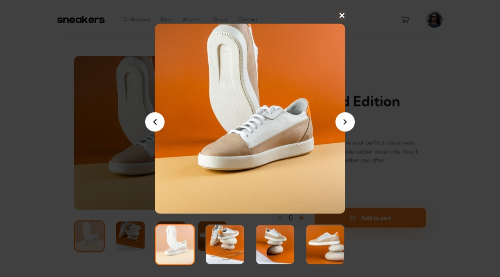

# Frontend Mentor - E-commerce product page solution

This is a solution to the [E-commerce product page challenge on Frontend Mentor](https://www.frontendmentor.io/challenges/ecommerce-product-page-UPsZ9MJp6). Frontend Mentor challenges help you improve your coding skills by building realistic projects.

## Table of contents

- [Overview](#overview)
  - [The challenge](#the-challenge)
  - [Screenshot](#screenshot)
  - [Links](#links)
- [My process](#my-process)
  - [Built with](#built-with)
- [Author](#author)

## Overview

### The challenge

Users should be able to:

- View the optimal layout for the site depending on their device's screen size
- See hover states for all interactive elements on the page
- Open a lightbox gallery by clicking on the large product image
- Switch the large product image by clicking on the small thumbnail images
- Add items to the cart
- View the cart and remove items from it

### Screenshot

### Links

- [Solution URL](https://your-solution-url.com)
- [Live Site URL](https://e-commerce-product-page-nu-pied.vercel.app/)

## My process

### Built with

- Mobile-first workflow
- [Qwik](https://qwik.builder.io/) - JS Framework
- [Sass](https://sass-lang.com/) - For styles

## Author

- Frontend Mentor - [@JAleXDesigN](https://www.frontendmentor.io/profile/JAleXDesigN)
- Twitter - [@Jonathan_HM9](https://www.twitter.com/@Jonathan_HM9)
